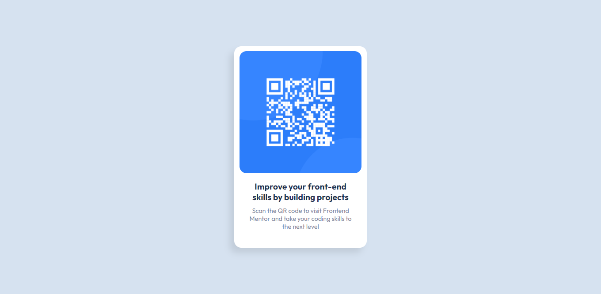

# Frontend Mentor - QR code component solution

This is a solution to the [QR code component challenge on Frontend Mentor](https://www.frontendmentor.io/challenges/qr-code-component-iux_sIO_H). Frontend Mentor challenges help you improve your coding skills by building realistic projects. 

## Table of contents

  - [Screenshot](#screenshot)
  - [Links](#links)
- [My process](#my-process)
  - [Built with](#built-with)
  - [Continued development](#continued-development)
  - [Useful resources](#useful-resources)
- [Author](#author)

### Screenshot

### Links

- Solution URL: (https://github.com/luciaguerra/qr-code-component)
- Live Site URL: (https://qr-code-component001.netlify.app)

## My process

### Built with

- Semantic HTML5 markup
- CSS custom properties
- Flexbox

### Continued development

From this project and on, I will continue to learn more about media queries and do my best to make every website correctly addapt to every screen size. Because, even though is responsive enough, there's still a lot to fix.

### Useful resources

- [MDN Web Docs](https://developer.mozilla.org/es/docs/Web/CSS/Media_Queries/Using_media_queries) - I was getting kind of stuck with media queries and this really cleared my mind when trying to make the design a little responsive.

## Author

- Frontend Mentor - [@luciaguerra](https://www.frontendmentor.io/profile/luciaguerra)
- Twitter - [@lucihtml](https://www.twitter.com/lucihtml)

